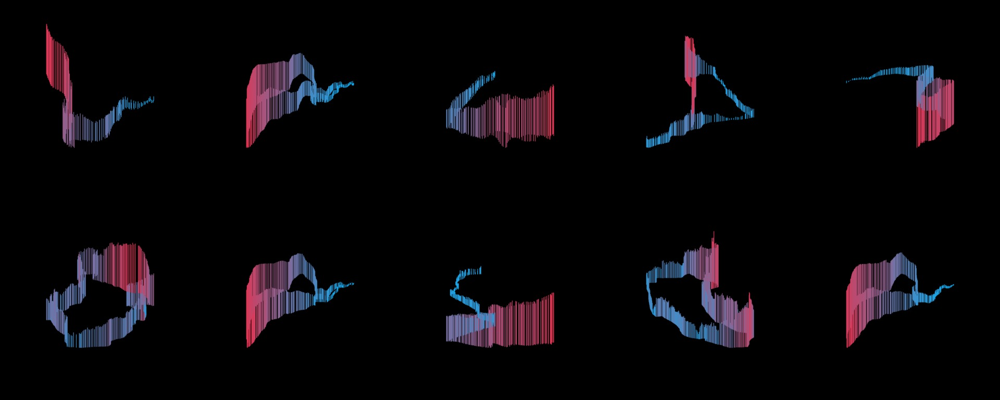

# movement

Scripts used to visualise my GPS tracks as [video] or [image].

- [Oto Brglez](https://github.com/otobrglez)

## Requirements

- gnuplot - With Homebrew install with `brew install gnuplot`.
- ffmpeg - With Homebrew install with `brew install ffmpeg`.

## Usage

1. Build folder of `tcx` files.

```bash
INPUT_FOLDER=~/Dropbox/Apps/RunGap/export OUTPUT_FOLDER=tmp ./bin/unzip-rungap.sh
```

2. Run visualizer script and wait a bit.

```bash
NUM_OF_FRAMES=360 NUM_OF_FILES=9 ./bin/visualizer.rb
```

3. Marge all images.

```bash
./bin/make_images.sh
```

4. Compile images into video.

```bash
./bin/make_big_video.sh
```

4. Love the output <3



[video]:https://vimeo.com/96191896
[image]:out-montage.jpg

